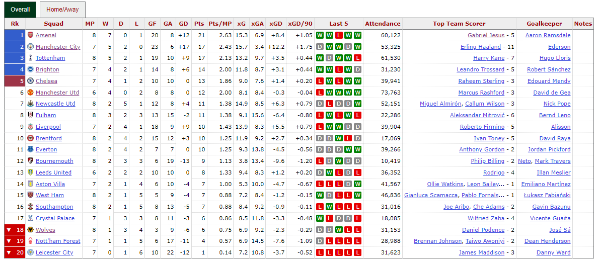
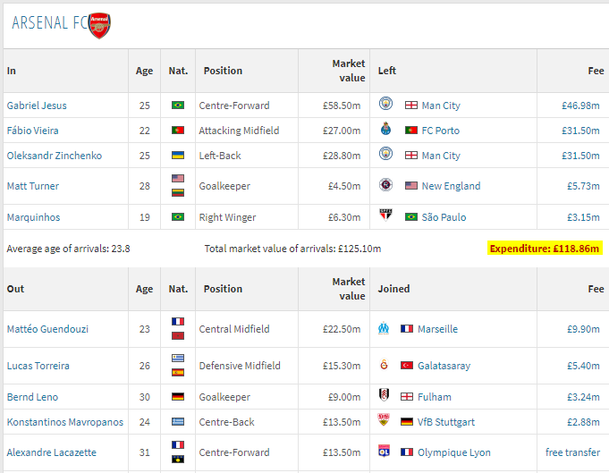
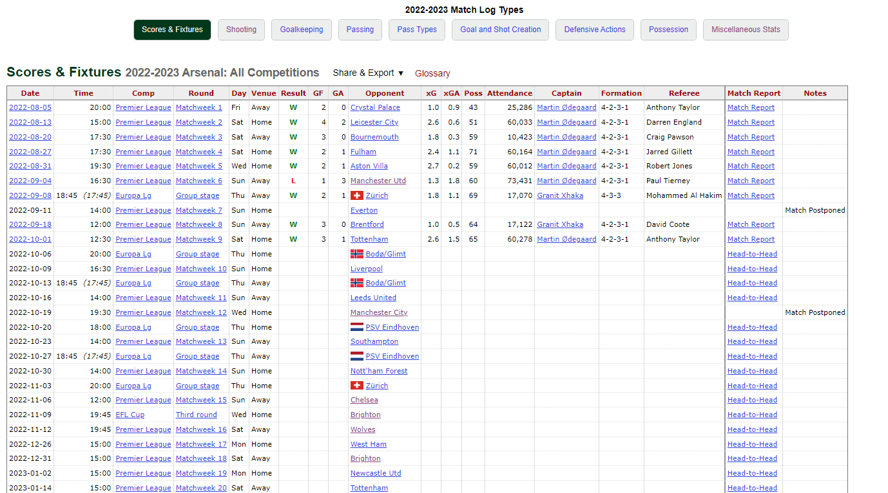
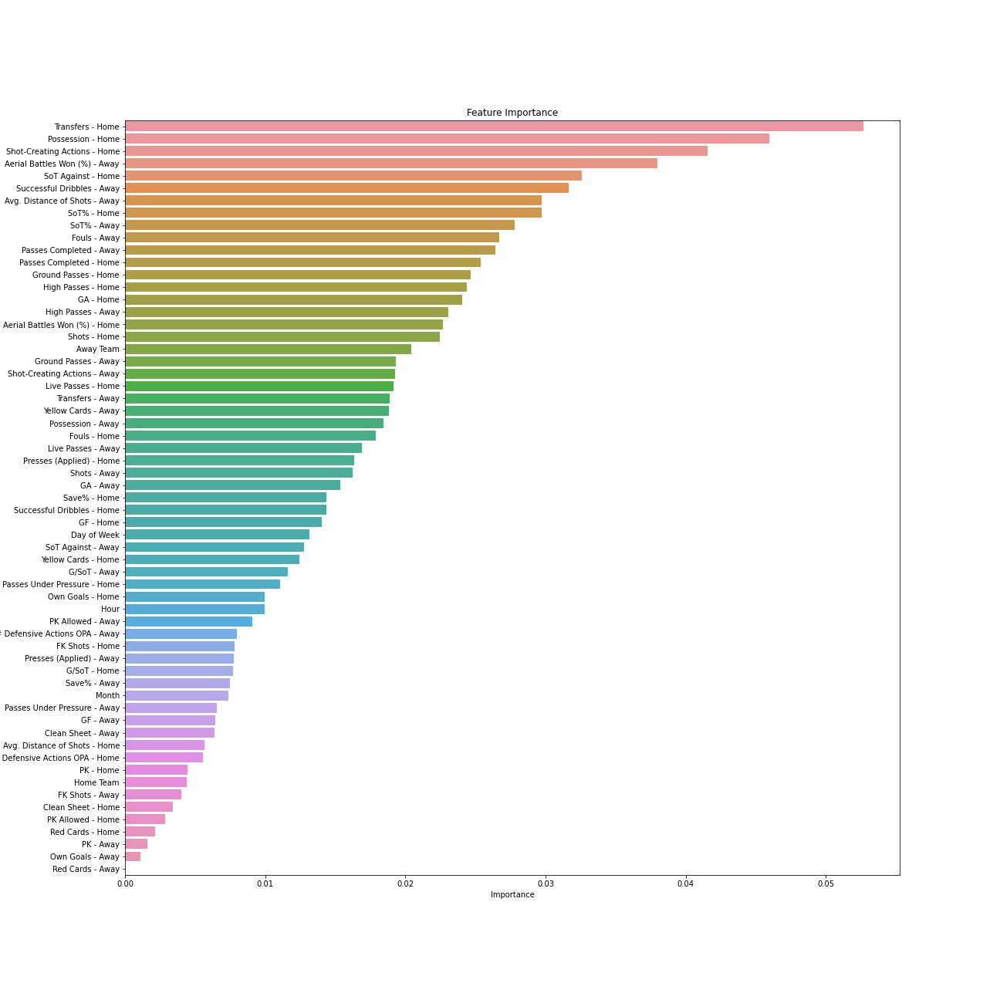

# Overview  

<p align="justify"> This project involved using machine learning to predict the outcome of football matches in the English Premier League. The data that was used was obtained through web scraping using Python. Random-Forest and XGBoost classification models were backtested and optimized on the 2021/2022 season, using data as far back as 2018/19 and then finally applied to the current 2022/23 season. As the season goes on more match results can be added to the training set to improve the accuracy of the model.</p>  
<br/>

# Scraping the Data  

Data was scraped from two different sources using the ***Requests*** library in Python and the HTML was parsed using ***BeautifulSoup***. The data for Premier League fixtures and team statistics was scraped from [FBref.com](https://fbref.com/en/comps/9/Premier-League-Stats), while another website called [TransferMarkt](https://www.transfermarkt.co.uk/) was used to scrape data on teams’ transfer expenses for each season. Transfer data was not available on FBref and it was desirable to see if this is also a significant predictor of match outcomes.  

### 1) Scraping Team Links From FBref

<p align="justify"> The following code was used to find the fixtures table for each season on FBref. The only input that changes is the curr_season value and the rest of the code runs dynamically. 
 </p>
<br/>

```python
import pandas as pd
import requests
from bs4 import BeautifulSoup
from urllib3.exceptions import InsecureRequestWarning
from lxml import html
import time
import difflib

# Turn off SSL Warning
requests.packages.urllib3.disable_warnings()

# Define URL & Header
curr_season = '2022-2023'
transfer_season = curr_season[0:4] 
url = 'https://fbref.com/en/comps/9/{0}/{1}-Premier-League-Stats'.format(curr_season, curr_season)
header_ = {"User-Agent": "Mozilla/5.0 (Windows NT 10.0; Win64; x64) AppleWebKit/537.36 (KHTML, like Gecko) Chrome/105.0.0.0 Safari/537.36", "Accept-Language": "en-US,en;q=0.9"}

# Make Request to URL
req = requests.get(url, headers = header_, verify = False)

# Parse HTML With BeautifulSoup
dat = BeautifulSoup(req.text)
league_table = dat.select('table.stats_table')[0]

# Find Links in HTML Text
team_links = league_table.find_all('a')
team_links = [link.get('href') for link in team_links]
team_links = [link for link in team_links if '/squads/' in link]

# Complete Each Link By Adding Prefix
pre = 'https://fbref.com'
team_links = [pre + link for link in team_links]
```

<p align="justify">An example of a season table can be seen below. The links for each team can be taken from this table so that we can later loop through each team link to get the team-specific stats. </p>
<br/>



### 2) Scraping Transfer Data 

<p align="justify"> The next section of code scrapes data from TransferMarkt, parses it, cleans it and stores it in a dataframe for later use. </p>
<br/>

```python
# Scrape Data from Transfermarkt.co.uk
urlT = 'https://www.transfermarkt.co.uk/premier-league/transfers/wettbewerb/GB1/plus/?saison_id={}&s_w=&leihe=0&intern=0&intern=1'.format(transfer_season)
trans_req = requests.get(urlT, headers = header_, verify = False)

# Parse HTML & Find Span Classes Containing Expenditures
transers = BeautifulSoup(trans_req.text)
transfer_data = transers.find_all("span", {"class":"transfer-einnahmen-ausgaben redtext"})
title_tags = transers.find_all("h2")[0:20]
tnames = [str(tag).split('"')[-2] for tag in title_tags]
expenditures = []

# Clean-Up Expenditure Data
for x in transfer_data:
    expenditures.append(x.text[17:22])
for i in range(0, 20):
    if expenditures[i] == '\t\t\t\t\t':
        expenditures[i] = 0
    if 'm' in str(expenditures[i]):
        expenditures[i] = expenditures[i].replace("m", "")
    if 'Th' in str(expenditures[i]):
        expenditures[i] = expenditures[i].replace("Th", "")
        expenditures[i] = float(expenditures[i])/1000
    expenditures[i] = float(expenditures[i])

# Create Dataframe for Each Team's Transfer Expenses
team_transfers = pd.DataFrame(data = tnames, index = range(0,20), columns = ["Team"])
team_transfers["Expenditures"] = expenditures

# Sort & Match Team Names
tn = []
names = [u.split("/")[-1].replace("-Stats", "").replace("-", " ") for u in team_links]

for i in range(0, 20):
    check_word = team_transfers["Team"][i]
    n = 1
    cutoff = 0.8
    close_match = difflib.get_close_matches(check_word, names, n, cutoff)
    team_transfers["Team"].iat[i] = close_match[0]
```

<p align="justify"> The webpage for each season contains tables for each team, their transfers for that season and the amount spent and received. The expenditure for each team was isolated in the script, an example of which can be seen below. </p>
<br/>



### 3) Scraping Team Statistics and Combining Data

<p align="justify"> Finally, we loop through each team on FBref to collect the bulk of the data. Here’s an example of what the Scores & Fixtures table looks like for each team: </p>
<br/>



<p align="justify"> This scores and fixtures table is scraped to give us the team’s fixtures for the season, the results of matches that have already been played and some other stats such as goals scored, goals against, possession and more. Above the Scores & Fixtures table there is also more links to other stats tables such as Shooting, Goalkeeping, Passing etc. These links were also scraped with a loop that was written to pass through each link, scrape the data for each table and combine these into a dataframe for each team.  </p>
<br/>

<p align="justify"> Given the large number of features in the raw data it was necessary to filter the data as many of these variables were of no use. This was done manually by selecting 24 features that were deemed to have the potential to have some impact on match results. Some examples include shots, shots on target, passes completed, possession, types of passes, defensive actions, penalties and free kicks. The full list can be seen in the code below or in the Excel files. </p>
<br/>

<p align="justify"> Finally, the Scores & Fixtures table for each team was merged with the combined stats tables and then concatenated into one dataframe containing data for all teams in that season, which was saved to CSV.  </p>
<br/>

```python
all_stats = []

# Loop Through Each Team URL
for url in team_links:
    team_req = requests.get(url, headers = header_, verify = False)
    team_name = url.split("/")[-1].replace("-Stats", "").replace("-", " ")
    for i in range(0, len(team_transfers)):
        if team_name == team_transfers["Team"][i]:
            team_exp = team_transfers["Expenditures"][i]
    time.sleep(1)

    # Use Pandas to Read the Scores & Fixtures Table for Each Team
    try:
        scores_fixtures = pd.read_html(team_req.text, match = "Scores & Fixtures")[0]
    except:
        scores_fixtures = pd.read_html(team_req.text, match = "Scores & Fixtures ")[0]
    scores_fixtures = scores_fixtures[scores_fixtures["Comp"] == "Premier League"]
    scores_fixtures.insert(loc = 9, column = "Team", value = team_name)
    scores_fixtures.insert(loc = 19, column = "Transfers - Home", value = team_exp)
    scores_fixtures = scores_fixtures.drop(columns = ["Comp", "xG", "xGA", "Attendance", "Captain", "Referee", "Match Report", "Notes"])

    # Parse HTML With BeautifulSoup & Find Links
    data = BeautifulSoup(team_req.text)
    squad_links = data.find_all('a')
    squad_links = [link.get('href') for link in squad_links]
    squad_links = [link for link in squad_links if link and 'matchlogs/all_comps/' in link]
    squad_links = list(dict.fromkeys(squad_links))
    squad_links = squad_links[1:]

    # Loop Through Extra Tables
    stats_list = []
    for link in squad_links:
        table_page = requests.get(pre + link, headers = header_, verify = False)
        table = pd.read_html(table_page.text)[0]
        table.columns = table.columns.droplevel()
        table = table[table["Comp"] == "Premier League"]
        if "/shooting/" not in link:
            table = table.drop(columns = "Date")
        if "/shooting/" in link:
            table = table.rename(columns={'Sh':'Shots', 'FK':'FK Shots'})
        if "/passing_types/" in link:
            table = table.rename(columns={'Live':'Live Passes', 'Cmp':'Passes Completed', 'Press':'Passes Under Pressure'})
        stats_list.append(table)
        time.sleep(1)

    # Combine Tables for Current Team
    combined = pd.concat(stats_list, axis = 1)
    combined = combined[["Date","Shots", "SoT%", "G/SoT", "Dist", "FK Shots", "PK", "SoTA", "Save%", "CS", "PKA", "#OPA", "Live Passes", "Passes Completed", "Passes Under Pressure", 
                        "Ground", "High", "SCA", "Press", "Succ%", "CrdR", "CrdY", "Fls", "OG", "Won%"]]
    team_stats = scores_fixtures.merge(combined, on = "Date")
    all_stats.append(team_stats)

# Create Dataframe for All Teams and Save to CSV
df = pd.concat(all_stats)
df = df.rename(columns = {'Poss':'Possession', 'SoTA':'SoT Against', 'Dist':'Avg. Distance of Shots', 'CS':'Clean Sheet', 'PKA':'PK Allowed', '#OPA':'# Defensive Actions OPA', 'Ground':'Ground Passes',
                        'High':'High Passes', 'SCA':'Shot-Creating Actions', 'Press':'Presses (Applied)','Succ%':'Successful Dribbles', 'CrdR':'Red Cards', 'CrdY':'Yellow Cards',
                        'Fls':'Fouls', 'OG':'Own Goals', 'Won%':'Aerial Battles Won (%)'})
df.to_csv("{}.csv".format(curr_season))
```  
<br/>

# Data Cleaning
<p align="justify"> After all the data was scraped the next step was to check the completeness of the data. The dataframes were checked for missing values using the code below, which prints out the dataframe (season) and columns that are missing some data. </p>
<br/>

```python
# Create Function to Get Variable Names
def get_name(df_):
    name = [x for x in globals() if globals()[x] is df_][0]
    return name
    
# Check Datasets for Missing Values
for df in dfx:
    for col in df.columns:
        if df[col].isnull().values.any():
            print(get_name(df), col)
```
Output:  
df18_19 SoT%  
df18_19 G/SoT  
df18_19 Avg. Distance of Shots  
df18_19 Save%  
df19_20 G/SoT  
df19_20 Save%  
df20_21 SoT%  
df20_21 G/SoT  
df20_21 Avg. Distance of Shots  
df20_21 Save%  
df21_22 G/SoT  
df21_22 Save%  
df22_23 G/SoT  
df22_23 Save%  

<p align="justify"> There was indeed some missing data but it can be deduced from the listed variables that contain missing entries that this was for technical reasons rather than data not being available. For example, in some matches a team may not take any shots and therefore could not have a value for Shot on Target (SoT) or Goals per Shot on Target (G/SoT). If this was the case then the values were simply imputed with a zero. The check was done again after imputation and found no missing values. </p>
<br/>

```python
# Impute Missing Values
for df in dfx:
    for i in range(0, len(df)):
        if pd.isnull(df["G/SoT"][i]):
            if df["SoT%"][i] == 0:
                df["G/SoT"].iat[i] = 0
            else:
                df["G/SoT"].iat[i] = df["GF"][i]/(df["Shots"][i] * df["SoT%"][i])
        if pd.isnull(df["Save%"][i]):
            if df["SoT Against"][i] == 0:
                df["Save%"].iat[i] = 0
        if df["Save%"][i] < 0:
            df["Save%"].iat[i] = 0
        if df["Shots"][i] == 0:
            df["SoT%"].iat[i] = 0
            df["G/SoT"].iat[i] = 0
            df["Avg. Distance of Shots"].iat[i] = 0

# Check Again For NaN After Imputation
for df in dfx:
    for col in df.columns:
        if df[col].isnull().values.any():
            print(get_name(df), col)
```
<br/>

# Feature Engineering

<p align="justify"> The names in the lists of opponent teams were slightly different from the list of home teams in some cases and needed to be mapped by using a dictionary. This was the case for certain clubs with names that could be spelled differently, for example Newcastle Utd instead of Newcastle United or Wolves instead of Wolverhampton Wanderers.  </p>

<p align="justify"> The following code performed this mapping and also created two new variables, one that indicated the season and another for the transfer expenses of the away team. Therefore we can have one column for the home team transfer expenses and another for the away team’s transfer expenses.  </p>
<br/>

```python
# Create Dictionary for Inconsistent Names
name_dict = {'Brighton':'Brighton and Hove Albion', 'Manchester Utd':'Manchester United', 'Newcastle Utd':'Newcastle United', 'Sheffield Utd':'Sheffield United', 
            "Nott'ham Forest":'Nottingham Forest', 'Tottenham':'Tottenham Hotspur', 'West Brom':'West Bromwich Albion', 'West Ham':'West Ham United', 'Wolves':'Wolverhampton Wanderers'}

# Replace Inconsistent Names in 'Opponent' & Add New Columns
for df in dfx:
    teams = list(dict.fromkeys(df["Team"]))
    exps = list(dict.fromkeys(df["Transfers - Home"]))
    df.insert(loc = 13, column = "Transfers - Away", value = ' ')
    season = get_name(df).replace('df', '')
    df["Season"] = season
    for i in range(0, len(df)):
        for key, value in name_dict.items():
            if df["Opponent"][i] == key:
                df["Opponent"].iat[i] = value
        for j in range(0, len(teams)):
            if df["Opponent"][i] == teams[j]:
                df["Transfers - Away"].iat[i] = exps[j]
```
<br/>

## Creating Moving Averages

<p align="justify"> The data cannot be used for machine learning in its current form because it only tells us how a team performed during a given match. If we want to be able to predict the outcome of a match we will not have this data available to us until after the match has ended. Therefore we need to create moving averages for each relevant statistic, which capture the past performance of the team over the previous games.  </p>

<p align="justify"> For example, if we take the shots on target metric, when predicting the outcome for an upcoming game it makes sense to look at how many shots on target the team managed in its three previous games. This type of moving average metric helps to give us a measure of their ‘form’ in recent matches.  </p>

<p align="justify"> A function was defined in order to take each statistic and calculate its moving average over the three previous games. The function takes a dataframe that is grouped by team, calculates the moving average and creates new columns containing this data, then finally removes the first three rows for each team. This is done because the moving average cannot be calculated for the first three rows given that it needs three values to do the calculation. Therefore the 4th match of the season for each team becomes our new starting point for each dataset.  </p>
<br/>

```python
# Define a Function That Calculates a Moving Average of Three Previous Games & Creates New Columns
def moving_average(team_grouped, cols, new_cols):
    mov_avg = team_grouped[cols].rolling(3, closed = "left").mean()
    team_grouped[new_cols] = mov_avg
    team_grouped = team_grouped.dropna(subset = new_cols)
    return team_grouped
```

<p align="justify"> The input columns were defined and the function was applied to each season dataframe. </p>
<br/>

```python
# Define the Input Columns
cols = df.columns[14:38]
cols = cols.append(df.columns[[6, 7, 10]])
new_cols = [f"{c} - Home" for c in cols]

# Group the Dataset by Team and Apply the MA Function
df_list = []
for df in dfx:
    df = df.groupby("Team").apply(lambda x: moving_average(x, cols, new_cols))
    df = df.droplevel("Team")
    df.index = range(df.shape[0])
    df["Match Number"] = range(1, len(df) + 1)
    df_list.append(df)
```
<br/>

## Away Team Moving Averages

<p align="justify"> Given that all data is from the perspective of the ‘Team’ column and not the ‘Opponent’ team we also need to replicate each moving average column so that we have stats for both sides of each fixture. We will then have 27 home team features and 27 away team features. </p>
<br/>

```python
# Define Away Cols
away_cols = [col.replace('Home','Away') for col in new_cols]
away_cols.append('Match Number')

# Add Columns for Away Team
final_dfs = []
for df in df_list:
    away = []
    for i in range(0, len(df)):
        opp = df['Opponent'][i]
        mdate = df['Date'][i]
        team_df = df[df['Team'] == opp]
        nrow = team_df[team_df['Date'] == mdate][new_cols]
        nrow.insert(loc = 27, column = 'Match Number', value = i + 1)
        away.append(nrow)
    combine = pd.concat(away)
    combine.columns = away_cols
    combine.index = range(combine.shape[0])
    df = df.merge(combine, on = 'Match Number')
    final_dfs.append(df)
```

<p align="justify"> The dataframes for each season were merged into one in order to encode the team names and also create some additional features for the time, month and day of week to see if these had some impact on match result.  </p>

<p align="justify"> The dataframes were merged to make categorical (team) encoding simpler. Given that in each season three teams are regulated and promoted, if we did encoding for each season individually (numbering the teams 1 to 20 so that our machine learning model can use this categorical data) we would have some inconsistencies and our model would think two different teams were the same. For example, if Wolves were encoded with the number 20 in one season but got regulated for the next season, the replacement (promoted) team would then get the code 20 and our model would think this was the same team.   </p>

<p align="justify"> Venue was also filtered to remove half the dataset as these were duplicates. When the data was scraped it was always taken from the perspective of one team and therefore each match was in the dataset twice. Filtering for Venue = Home means our ‘Team’ column always contains the home team for each fixture and the ‘Opponent’ column contains the away team.  </p>
<br/>

```python
# Merge Datasets
dfT = pd.concat(final_dfs)

# Filter 'Away' to Remove Duplicate Match
dfT = dfT[dfT['Venue'] == 'Home']

# Convert Categorical Data to Numerical & Fix Opponent Names
dfT["Date"] = pd.to_datetime(dfT["Date"], dayfirst = True)
dfT["Home Team"] = dfT["Team"].astype("category").cat.codes
dfT["Away Team"] = dfT["Opponent"].astype("category").cat.codes
dfT["Hour"] = dfT["Time"].str.replace(":.+", "", regex = True).astype("int")
dfT["Day of Week"] = dfT["Date"].dt.dayofweek
dfT["Month"] = dfT["Date"].dt.month
dfT["Output"] = (dfT["Result"] == 'W').astype("int")
```
<br/>

<p align="justify"> A variable called ‘Output’ was created based on the result column so that we can run a binary classification model on the data. If the home team won this was given a value of 1 and if the home team lost or drew this was given a value of 0. It would also be possible to use a multiclass classification model here (win, draw & lose) but since draws make up a small percentage of overall results it was decided to use a simpler binary classification model. </p>

<p align="justify"> Finally the dataframe was filtered to contain only the desired features for the next section (modelling) and saved to CSV.  </p>
<br/>

```python
# Drop Unwanted Features and Save to Excel
features = dfT.copy()
remove_cols = cols.append(dfT.columns[1:6]).append(dfT.columns[[11, 66]])
features = features.drop(columns = remove_cols)
features = features.sort_values("Date")
features.to_csv('Features.csv')
```
<br/>

# Modelling

<p align="justify"> A Random Forest classifier was used to try to predict the outcomes of matches. Several iterations were made to try to improve the model, starting with a very basic model and adding features and training data to improve accuracy. A grid search was also performed in order to fine-tune the model’s parameters and optimize the results. An XGBoost classifier was also tried to see if it could beat the Random Forest model.  </p>

<p align="justify"> Given the fact that we are currently only 7 games into the 22/23 season, backtesting was performed on the 21/22 season and then the model was applied to 22/23. When more data is available the played games for this year could be added to the training set and could possibly improve the accuracy of the models even more.  </p>

<p align="justify"> First a function was defined so the Random Forest model could be replicated easily: </p>
<br/>

```python
# Define a Function for Random Forest Model
def RFC_model(train, test, predictor_list):
    RFC = RandomForestClassifier(n_estimators = 100, random_state = 1, min_samples_split = 10)
    RFC.fit(train[predictor_list], train["Output"])
    predictions = RFC.predict(test[predictor_list])

    acc_score = accuracy_score(test["Output"], predictions)
    return print("Accuracy: {:.2f}%".format(acc_score*100))
```
<br/>

<p align="justify"> The model was first trained using data from a single season, 2020/2021, to predict all games of the 2021/22 season. This model used only basic predictors; home team, away team, time of day, day of week and month of the year.   </p>
<br/>

```python
# Train Model on 2020/2021 Season to Predict 2021/2022 Season - Basic Predictors
basic_predictors = ["Home Team", "Away Team", "Hour", "Day of Week", "Month"]
training_set = data[data["Season"] == '20_21']
test_set = data[data["Season"] == '21_22']
RFC_model(training_set, test_set, basic_predictors)
```
Accuracy: 55.14%
<br/>

<p align="justify"> The result was an accuracy of 55.14%. Even using such basic predictors and one season of training data this is a pretty decent result. Already the model is better than random. Next we can add another season of training data to see if it improves the result. Here the training set consists of 19/20 and 20/21.  </p>
<br/>

```python
# Train Model on Two Previous Seasons to Predict 2021/2022 Season - Basic Predictors
values = ['19_20', '20_21']
training_set = data[data["Season"].isin(values)]
test_set = data[data["Season"] == '21_22']
RFC_model(training_set, test_set, basic_predictors)
```
Accuracy: 59.71%
<br/>

<p align="justify"> The accuracy improved to 59.71%, a significant improvement. The next step involves adding all the extra predictors, these are the moving average figures that were created in the feature engineering section earlier. </p>
<br/>

```python
# Add Extra Predictors
predictors = list(data.columns[4:66])
predictors.remove('Season')
training_set = data[data["Season"].isin(values)]
test_set = data[data["Season"] == '21_22']
RFC_model(training_set, test_set, predictors)
```
Accuracy: 62.57%
<br/>

<p align="justify"> This improved accuracy to 62.57%. Now let’s take data from the first half of 21/22, combine it with the training data from all previous seasons (back as far as 2018/19) and then try to predict only the second half of the 21/22 season. This resulted in a slight improvement to 63.45%. </p>
<br/>

```python
# Add In Data from Current Season for Training Set
training_set = data[data["Date"] < '2022-01-01']
test_set = data[data["Season"] == '21_22']
test_set = test_set[test_set["Date"] >= '2022-01-01']
RFC_model(training_set, test_set, predictors)
```
Accuracy: 63.45%
<br/>
<br/>

## Optimization

<p align="justify"> Now it’s time for optimization. The model so far has been using only one set of hyperparameters (n_estimators = 100, random_state = 1, min_samples_split = 10). A custom-coded grid search was written to find the combination of hyperparameters that maximized the accuracy score. Other metrics were also checked just in case we are falling into the accuracy trap.  </p>
<br/>

```python
# Optimize Model Using Custom Grid Search
from sklearn.model_selection import ParameterGrid
RF_Classifier = RandomForestClassifier()
p_grid = ParameterGrid({"n_estimators": [90, 100, 110, 120],
                        "random_state": [1],
                        "min_samples_split": [7, 10],
                        "max_samples": [10, 20, 30]})

# Loop Through Parameter Grid
accuracies = []
combinations = []
for p in p_grid:
    RF_Classifier.set_params(**p)
    RF_Classifier.fit(training_set[predictors], training_set["Output"])
    predictions = RF_Classifier.predict(test_set[predictors])

    acc_score = accuracy_score(test_set["Output"], predictions)
    prec_score = precision_score(test_set["Output"], predictions)
    recall = recall_score(test_set["Output"], predictions)
    cf = confusion_matrix(test_set["Output"], predictions)
    accuracies.append(acc_score)
    combinations.append(p)
    
max_score = max(accuracies)
score_index = accuracies.index(max_score)
op_combination = combinations[score_index]
print("Best Parameters: ", op_combination)
print("Accuracy: {:.2f}%".format(max_score*100))
```
Best Parameters:  {'max_samples': 20, 'min_samples_split': 10, 'n_estimators': 110, 'random_state': 1}  
Accuracy: 65.48%
<br/>

```python
# Check Other Accuracy Metrics with Optimized Model
RF_check = RandomForestClassifier()
RF_check.set_params(**op_combination)
RF_check.fit(training_set[predictors], training_set["Output"])
predictions = RF_check.predict(test_set[predictors])

acc_check = accuracy_score(test_set["Output"], predictions)
prec_check = precision_score(test_set["Output"], predictions)
recall_check = recall_score(test_set["Output"], predictions)
cf = confusion_matrix(test_set["Output"], predictions)

print("Accuracy: {:.2f}%".format(acc_check*100))
print("Precision: {:.2f}%".format(prec_check*100))
print("Recall: {:.2f}%".format(recall_check*100))
print(cf)
```
Accuracy: 65.48%  
Precision: 66.07%  
Recall: 43.02%  
[92,   19]  
 [49,   37]]
<br/>

<p align="justify"> This improved the accuracy to 65.48%. Now the model is starting to perform really well in comparison to where we started. We also have a good precision score of 66.07% and a recall score of 43.02%. </p>
<br/>

## Feature Importance

<p align="justify"> The feature importance attribute of the Random Forest classifier was used to find out which features were the most significant for the optimized model.  </p>

```python
# Feature Importance
feature_importance = pd.DataFrame(RF_Classifier.feature_importances_, index = predictors, columns=['Importance']).sort_values('Importance', ascending=False) 
plt.figure(figsize = (18, 18))
sns.barplot(y = feature_importance.index, x = feature_importance["Importance"])
plt.title('Feature Importance')
plt.xlabel('Importance')
plt.ylabel('Features')
plt.savefig('feature_importance.jpg')
```


<p align="justify"> This produced the following chart: </p>



<p align="justify"> Interestingly, the most important feature was one of the variables for transfer market expenses. The next most importance features were possession, shot-creating actions, aerial battles won and shots on target against.  </p>

<p align="justify"> Some of the least importance features were red cards, yellow cards, penalty kicks allowed and own goals. This may seem counter-intuitive, however it makes sense given the way the data was compiled. Even though a red card or penalty may even be the most important determinant of an outcome of the match in which it happens, it wouldn’t really have an significant impact on the following matches when computed as a moving average. Events such as own goals and red cards are also so rare that there isn’t much data available for our model.  </p>
<br/>

## Running the Final Models

<p align="justify"> After optimization the model can now be ran on the 2022/23 season, using the games that have been played so far as the test set. Unfortunately, given that we lost 3 games of the season due to the moving average function this is a small test set.  </p>

```python
# Run Model on 2022/2023 Season
training_set = data[data["Date"] < '2022-08-27']
test_set = data[data["Date"] >= '2022-08-27']

RF_ = RandomForestClassifier()
RF_.set_params(**op_combination)
RF_.fit(training_set[predictors], training_set["Output"])
predictions = RF_.predict(test_set[predictors])

acc_check = accuracy_score(test_set["Output"], predictions)
prec_check = precision_score(test_set["Output"], predictions)
recall_check = recall_score(test_set["Output"], predictions)
cf = confusion_matrix(test_set["Output"], predictions)

print("Accuracy: {:.2f}%".format(acc_check*100))
print("Precision: {:.2f}%".format(prec_check*100))
print("Recall: {:.2f}%".format(recall_check*100))
print(cf)
```
Accuracy: 70.27%  
Precision: 90.00%  
Recall: 47.37%  
[17,  1]  
 [10,  9]  
 
<p align="justify"> The result was very impressive with an accuracy of 70.27%. We also got a very high precision of 90% and a recall score of 47.37%. The relatively low recall score means that the model is predicting a large number of false negatives. This may be due to a slightly uneven dataset given that draws plus losses (0) outweighs wins (1). </p>
<br/>

## XGBoost

<p align="justify"> An XGBoost classifier was tested to see if we could outperform the Random Forest model. The same grid search was used to try to fine-tune the parameters of the boosted model.  </p>

```python
# Try XGBoost Model
from sklearn.ensemble import GradientBoostingClassifier
XGB = GradientBoostingClassifier()

# Optimize Model Using Custom Grid Search
p_grid = ParameterGrid({"loss": ['log_loss', 'exponential'],
                        "n_estimators": [80, 90, 100, 110, 120],
                        "random_state": [1],
                        "min_samples_split": [3, 5, 7, 10],
                        "learning_rate": [0.1, 0.2, 0.3]})

# Loop Through Parameter Grid
accuracies = []
combinations = []
for p in p_grid:
    XGB.set_params(**p)
    XGB.fit(training_set[predictors], training_set["Output"])
    predictions = XGB.predict(test_set[predictors])

    acc_score = accuracy_score(test_set["Output"], predictions)
    prec_score = precision_score(test_set["Output"], predictions)
    recall = recall_score(test_set["Output"], predictions)
    cf = confusion_matrix(test_set["Output"], predictions)
    accuracies.append(acc_score)
    combinations.append(p)
    
max_score = max(accuracies)
score_index = accuracies.index(max_score)
op_combination = combinations[score_index]
print("Best Parameters: ", op_combination)
print("Accuracy: {:.2f}%".format(max_score*100))
```
Best Parameters:  {'learning_rate': 0.2, 'loss': 'exponential', 'min_samples_split': 5, 'n_estimators': 120, 'random_state': 1}  
Accuracy: 72.97%
<br/>

```python
# Check Other Accuracy Metrics with Optimized Model
xgb_check = GradientBoostingClassifier()
xgb_check.set_params(**op_combination)
xgb_check.fit(training_set[predictors], training_set["Output"])
predictions = xgb_check.predict(test_set[predictors])

acc_check = accuracy_score(test_set["Output"], predictions)
prec_check = precision_score(test_set["Output"], predictions)
recall_check = recall_score(test_set["Output"], predictions)
cf = confusion_matrix(test_set["Output"], predictions)

print("Accuracy: {:.2f}%".format(acc_check*100))
print("Precision: {:.2f}%".format(prec_check*100))
print("Recall: {:.2f}%".format(recall_check*100))
```
Accuracy: 72.97%  
Precision: 71.43%  
Recall: 78.95%  
[12,    6]  
 [ 4,   15]
<br/>

<p align="justify"> This resulted in an impressive accuracy of 72.97%. We can see that boosted model not only achieves a higher accuracy, but it doesn’t predict as many false negatives as the RF model, resulting in a much higher recall score of 78.95%. The precision is admittedly lower at 71.43% but this is still very good. Overall the boosted model is very successful at predicting the outcomes of premier league fixtures. </p>
<br/>

# Conclusions

<p align="justify">-  	Machine learning can used to successfully predict the outcomes of sports fixtures with a high degree of accuracy, if good data is available. </p>
<p align="justify">-  	Web scraping is a very effective technique for creating datasets in order to predict the results of matches.  </p>
<p align="justify">-  	There are many other complex strategies that could be used to try to beat the models in this project, for example scraping in-game data rather than using moving averages alone.  </p>
<p align="justify">-  	Decision-tree and ensemble/boosted models are very effective at this type of predictive modelling, especially if the data contains categorical variables.  </p>
